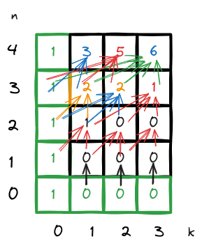

# K-Inversed Pairs

K-Inversed pairs ဆိုတာ List တစ်ခုမှာဖြစ်နိုင်ချေရှိတဲ့ Permuatation combination အရေအတွက်ကို K-inversed pair count ပေါ်မူတည်ပြီးကြည့်တာဖြစ်ပါတယ်။

K ဆိုတာက number of pairs ကိုဆိုလိုချင်တာပါ။ Placeholder လို့မြင်လို့ရပါတယ်။ ဥပမာ - List A ပဲထား သူ့မှာ Inversed pair တစ်စုံရှိမယ်ဆိုရင် Sort မဖြစ်ရသေးတဲ့ elements ၂ ခုပါနေတာကိုဆိုလိုတာပါ။

Inversed ဆိုတာက မြန်မာလို ဆီလျော်အောင်ဘာသာပြန်ရရင် ပြောင်းပြန်ဖြစ်နေတာမျိုးကိုပြောချင်တာပါ။ Context ပေါ်မူတည်ပြီးကွဲလွဲနိုင်ပါတယ်။ List context မှာတော့ Ascending ဖြစ်နေတာကို normal လို့သတ်မှတ်ပြီး Descending ဖြစ်နေတာကို Inverse ဖြစ်နေတယ်လို့ဆိုလိုချင်တာပါ။

ဒီ Concept ကို Array တစ်ခုက sort စီပြီးပီလား မစီရသေးဘူးလားဆိုတာကို Verify လုပ်တဲ့နေရာမှာလည်းသုံးပါတယ်။ Usecase တွေကို theory ရှင်းပြီးသွားရင် ထပ်ရှင်းပါ့မယ်။

K-inverse array ကို List တစ်ခုက ဘယ်လောက် Degree ထိစီပြီးသားလဲဆိုတာကိုစစ်ဆေးတဲ့နေရာမှာသုံးပါတယ်။

## What is K-Inversed Pairs.
An inverse pair in an array is a pair of indices $(i, j)$ such that $i < j$ and $A[i] > A[j]$.

မြန်မာလိုပြန်ရရင် inverse pair ဆိုတာက indices ၂ခုပါတဲ့ အစုံဖြစ်ပါတယ််။ $(i, j)$ ပဲ ဆိုပါစို့။ i က j ထက်ကြီးပြီး $list[i]$ မှာရှိတဲ့ elements က $list[j]$ မှာရှိတဲ့ Element ထက် ငယ်နေမယ်ဆိုရင် $(i,j)$ ကို Inverse pair လို့သတ်မှတ်လို့ရပါတယ်။

အိုကေ ဒါကသူ့ defination ပါ။
ဘာကိုဆိုလိုသလဲဆိုရင် - ဆိုပါစို့ ကျတော့်မှာ $listA = [1,2,3]$ ရှိတယ်ဆိုပါစို့။ ဒီ Array က asscending စီပြီးသားဖြစ်လို့ Pair က 0 ဖြစ်ပါတယ်။ သူ့အခြေအနေက $i < j$, $A[i] \leq A[j]$ ဒီလိုဖြစ်နေမှာပါ။

နောက်ဥပမာဆက်ကြည့်ရအောင်။

Consider the array $[3, 1, 2]$ ဒီကောင်မှာဆိုရင် 3 က ရှေ့ဆုံးကိုရောက်နေပါတယ်။ 1,2 ကတော့ အစဥ်လိုက်တိုင်းဖြစ်နေတယ်။ ဒီခြေနေမျိုးမှာဆိုရင် Inverse pairs တွေကတော့ (0,1) နဲ့ (0,2) ပါ။
- $(0, 1)$: because $3 > 1$
- $(0, 2)$: because $3 > 2$
- Total number of inverse pairs: 2.

နောက်ဆုံး ဥပမာကိုကြည့်ပါ။

Consider the array $[4, 3, 2, 1]$ ဒီ ေကာင်မှာက Unsort ဖြစ်နေတာက အကုန်လုံးပါပဲ။
   - The inverse pairs are:
     - $(0, 1)$: because $4 > 3$
     - $(0, 2)$: because $4 > 2$
     - $(0, 3)$: because $4 > 1$
     - $(1, 2)$: because $3 > 2$
     - $(1, 3)$: because $3 > 1$
     - $(2, 3)$: because $2 > 1$
   - Total number of inverse pairs: 6.


## Use Case
အိုကေ ဒါဆိုဘယ်နေရာမှာသုံးမလဲ။

List တစ်ခုက inverse pair နည်းနေမယ်ဆိုရင် ဒီ List က almost sorted ဖြစ်နေတာပါ။
တကယ်လို့ Inverse pairs ကများနေရင် list က sorted လုပ်ဖို့လိုနေပါပီ။ 

Algorithm တွေမှာ List က Nearly sorted ဆိုရင် Insertion sort ကိုသုံးတာက ပို efficient ဖြစ်ပြီး မဟုတ်ရင် တခြားတစ်ခုပြောင်းစဥ်းစားတာမျိုးပေါ့။ 

Adptive alogrmithsm တွေ ရေးတဲ့အခါ မှာသုံးတယ်။ ဥပမာ Timsort လိုမျိုး။ သူက Merge sort နဲ့ Insertion sort ၂ ခုပေါင်းထားတာ။ ဒီတော့ List က Nearly sorted ဆိုရင် Insertion sort ကိုသုံးတာမျိုး။

I hope you got it.

နောက်ပီး Version control system တွေမှာလည်း Changes detect ဖြစ်ဖို့သုံးတယ်။ (တခြား Algorithms တွေနဲ့တော့ပေါင်းရမှာပေါ့)


## Dynamic Programming Approach

အပေါ်ကပြောခဲ့တာက သူ့ Concept သီးသန့်ပါပဲ။ ကျတော်တို့က ဒီ logic ကို dp မသုံးပဲရေးလို့ရပါတယ်။ ဒါပေမယ့် ကိုယ်က efficient ဖြစ်အောင်ကူဖို့ သုံးပါတယ်ဆိုမှ efficient ဖြစ်မနေရင် Program ကပိုပြီး လှုပ်လေမြုပ်လေအခြေအနေကိုရောက်သွားမှာပါ။

ဥပမာ အောက်က rust source code က အပေါ်က Concept ကိုလက်တမ်းချရေးထားတာပါ။ Complexity က $O(n^2)$ ပါ။

```rust
fn count_inverse_pairs(arr: &[i32]) -> usize {
    let mut count = 0;
    for i in 0..arr.len() {
        for j in i+1..arr.len() {
            if arr[i] > arr[j] {
                count += 1;
            }
        }
    }
    count
}

fn main() {
    let arr = [3, 1, 2];
    println!("Number of inverse pairs: {}", count_inverse_pairs(&arr)); // Output: 2
}
```

ဆက်မပြောခင် Scanerio အရင်ပြောပါ့မယ်။

Let's say length as $n$ and number of pairs as $k$. 

ကျွန်တော် Confirm လုပ်မှာက pair count(K) နဲ့ size of list($n$) ပေးမယ်။ Program က k - pair count ရှိတဲ့ list အရေအတွက်ကိုပြန်ပေးမှာပါ။


ဥပမာ ကျတော်က n = 3, k = 1 ဆိုရင် pair count က 2 ပြန်ပေးပါ့မယ်။

ဒီတော့ size 3 ရှိတဲ့ List တစ်ခုရဲ့ Permuatation possibility က 3! မို့ အောက်ပါအတိုင်း ၆ ခုရှိနေမှာပါ။

- [1, 3, 2] - 1 inverse pair: (3, 2)
- [1, 2, 3] - 0 inverse pairs
- [3, 1, 2] - 2 inverse pairs: (3, 1), (3, 2)
- [3, 2, 1] - 3 inverse pairs: (3, 2), (3, 1), (2, 1)
- [2, 1, 3] - 1 inverse pair: (2, 1)
- [2, 3, 1] - 2 inverse pairs: (2, 1), (3, 1)

ဒီထဲကမှာ inverse pair (k) အရေအတွက် ၂ ခုပဲရှိတာက [2, 3, 1] နဲ့ [3, 1, 2] ဖြစ်ပါတယ်။

ဒါကြောင့်မို့ $fn(n,k)$ = numbers of array that have '$r$' amount of pairs.


ဒါကိုကျတော်တို့က DP သုံးပြီး ရှင်းလို့ရပါတယ်။ 

နည်းကရီုးရှင်းပါတယ်။ DP table တစ်ခုဆောက်ပါမယ်။ Table size ကတော့ Size of List * Inversed Pairs ဖြစ်ပါတယ်။ 2D array ပါ။ ကျတော်တို့က ဒီ Table ကို pairs အရေတွက်ကိုဖြည့်ရမှာပါ။ ဒီလိုဖြည့်ဖို့အတွက် Recurrence relation ကို အောက်က equation ကိုသုံးပြီးဖြည့်ရုံပါပဲ။

$$dp[n][k] = \sum_{j=0}^{\min(k, n-1)} dp[n-1][k-j]$$

equation အတိုင်း ဖြည့်လိုက်ရင် အောက်ကပုံအတိုင်း ဇယားတစ်ခုရလာမှာပါ။ မျှားတွေက အပေါင်း Operation ကိုဆိုလိုချင်တာပါ။ (အစိမ်းခြယ်ထားတာတွေက Default value ပါ။)



ကျတော်တို့က ဒီ Table ကိုကြည့်ပီး n Array size ရှိတဲ့ List မှာ လိုချင်တဲ့ k inverse pair ပေါ်မူတည်ပြီး numbers of array ကိုတန်းသိနိုင်မှာဖြစ်ပါတယ်။

ဆိုပါစို့ - elements 4 ခုပါတဲ့ array မှာ 1 inverse pair ရှိတဲ့ array က ၃ ခုရှိမှာပါ။

အပေါ်က Example အရဆိုရင် n = 3, k = 1 ပါ။ ဒီလိုဆိုရင် numbers of array က 2 ပါ။ ကျွန်တော်တို့က table ကို Look up ကြည့်တာက $O(1)$ ဖြစ်တဲ့အတွက်အရမ်းမြန်ပါတယ်။

ဒါ့အပြင် Table fill လုပ်တဲ့ကြာချိန်က $O(n * k)$ ဖြစ်ပါတယ်။

Pseudo code ကိုအောက်ပါအတိုင်းမြင်နိုင်ပါတယ်။

## Pseudo Code


```pseudo
function kInversePairs(n, k)
    if k == 0 then return 1
    if k > n * (n-1) / 2 then return 0

    dp = array of size (n+1) x (k+1) initialized to 0
    dp[0][0] = 1

    for i from 1 to n
        for j from 0 to k
            for m from 0 to min(j, i-1)
                dp[i][j] = dp[i][j] + dp[i-1][j-m]

    return dp[n][k]
```

## Optimized Pseudo Code

ဒီကောင်ကတော့ပိုပြီး Efficient ဖြစ်ပါတယ်။ sliding window Technique ကိုသုံးထားတာပါ။

```pseudo
function kInversePairs(n: integer, k: integer) -> integer:
    MOD_VALUE = 1000000007  // Define the modulus value

    // Base cases
    if k == 0 then return 1
    if k > n * (n - 1) / 2 then return 0

    // Initialize the dp array
    dp = array of size (n + 1) x (k + 1) initialized to 0
    dp[0][0] = 1

    // Fill the dp array
    for i from 1 to n:
        prefix_sum = array of size (k + 1) initialized to 0
        prefix_sum[0] = dp[i - 1][0]
        for j from 1 to k:
            prefix_sum[j] = (prefix_sum[j - 1] + dp[i - 1][j]) % MOD_VALUE

        for j from 0 to k:
            if j == 0:
                dp[i][j] = dp[i - 1][j]
            else:
                dp[i][j] = prefix_sum[j]
                if j >= i:
                    dp[i][j] = (dp[i][j] - prefix_sum[j - i] + MOD_VALUE) % MOD_VALUE

    return dp[n][k]
```
#
